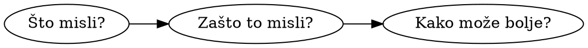
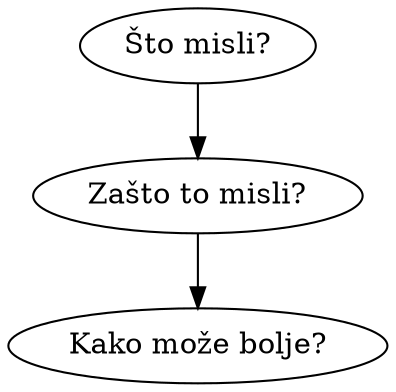

# Cilj rasprave

Kad raspravljamo s drugim ljudima, mislim kako zaboravimo da bi trebali imati nekakav cilj.

Neću vam govoriti što bi taj cilj trebao biti. Odlučite sami. No bilo bi dobro kad bi ga osvijestili. Pitajte se: Što želim dobiti iz ove rasprave? Hoće li me moja sljedeća rečenica dovesti bliže tom cilju, ili će me spriječiti da ga ostvarim?

Govorim to zato što mi se često učini da lutam u razgovorima. Dobro počne, ali s vremenom postane samo niz reakcija: ja reagiram na neki detalj izrečenog, druga strana reagira na moj ton, i te reakcije s vremenom odlutaju u nekom 

1. Želim saznati *što misli*, koji su njegovi stavovi, do kojih zaključaka je došao.

2. Želim shvatiti *zašto* sugovornik ima takvo mišljenje. Na čemu ga temelji? Kako je došao do svojih zaključaka? Koja je njegova perspektiva na problem?

3. Želim pomoći svom sugovorniku da *bolje razmišlja*. Da prepozna slabe točke svoje argumentacije, da 

Unutar par rečenica imam poprilično jak osjećaj kako znam što misli, zašto tako misli, i da je kreten.

Želim otkriti što je stvarno istina, koje su sve relevantne činjenice, što je netko od nas dvoje krivo shvatio ili krivo zaključio.

Želim pokušati promijeniti sugovornikovo mišljenje ili metode dolaženja do zaključka. Želim mu pomoći da bude bolje informiran ili razumniji.

Želim utjecati na publiku koja sluša ili čita naš razgovor. Nije mi toliko stalo što moj sugovornik misli.

Želim impresionirati druge osobe svojim intelektom, znanjem i debatnim vještinama. Želim se osjećati važno.

Želim testirati vlastitu sposobnost raspravljanja, da vidim drže li moji argumenti vodu i pod pritiskom.

Želim pobijediti sugovornika u igri nadmudrivanja i retorike, jer volim pobijeđivati. Najbolje se osjećam kad dominiram nad drugima.

Želim isprovocirati drugu osobu da izgubi takt i poludi. Jako me zabavlja kad drugi ljudi šize.
