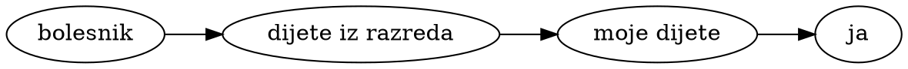
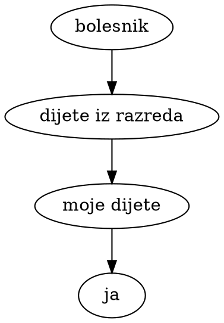
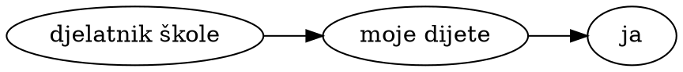
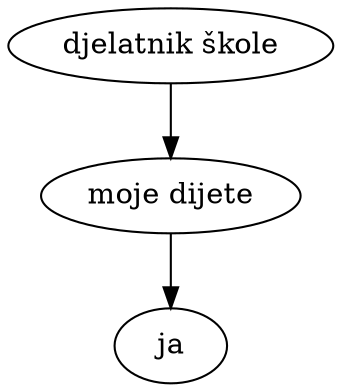

# Prenose li djeca COVID-19?

_Hrvoje Šimić, 2020-05-04_

<p class="low-key card-panel yellow lighten-4">
<b>Oprez</b>: Autor nije stručnjak iz područja zdravstva. Ako tražite stručna mišljenja, neka možete pronaći na linkovima u ovom članku.
</p>

<span class="dropcap">D</span>ošao je i taj dan, mi roditelji moramo odlučiti hoće li nam djeca nazad u školu. Nisam se osjetio dovoljno informiran da mogu formirati mišljenje je li to dobro za moju obitelj, pa sam se bacio na istraživanje. Ako vam nešto od ovog može dobro doći u vašem vlastitom istraživanju, slobodno pogledajte.

Pretražio sam vijesti o ponovnom otvaranju škola u Europi, i ispostavilo se kako Hrvatska nije izuzetak. Većina zemalja Europske Unije je otvorila osnovne škole ili to planira skoro napraviti. Samo Italija, Rumunjska i Bugarska su objavili da ne namjeravaju otvarati osnovne škole prije ljeta. Švedska, Island i Bjelorusija nikad nisu prekidali fizičku nastavu u osnovnim školama, iako je Bjelorusija bila produžila proljetne praznike na dva tjedna.

<figure id="ReopeningFig">
  <div id="ReopeningMap">Učitavam kartu...</div>
  <figcaption>
    Datumi otvaranja (ili djelomičnih otvaranja) nižih razreda osnovnih škola, stvarni ili planirani.
    Zemlje u kojima nije još donesen plan otvaranja su označene upitnikom.
    Zemlje u kojima nikad nije ni bilo zatvaranja osnovnih škola su označene kvačicom ✓.
    Izvori po zemljama: 
    <span id="SourcesForMap">učitavam...</span>
  </figcaption>
</figure>

U čemu je problem s postepenim otvaranjem škola i vrtića, i zašto se najmanja djeca često guraju prva nazad u kolektiv?

Prvo je pitanje koliko su sama djeca ugrožena novim koronavirusom. Iako znamo jako malo o njemu, postoji širok konsenzus kako inače zdrava djeca nisu ugrožena. Vjerojatnost da će im se nešto loše dogoditi je na razini opasnosti tipičnih sezonskih virusa.

Veći problem je širenje zaraze kroz populaciju preko djece u razredu. Na taj način zaraza može kolati i između kućanstava u istom mjestu ili kvartu. Kako bi se ja mogao zaraziti? Tipično bi to išlo ovako:




To bi mogao biti "most" između dva kućanstva. Djeca bi mogla dolaziti zarazna u školu i više dana prije nego što itko shvati da bi dijete trebalo izolirati. No kolika je šansa da će se taj lanac događaja poklopiti? Da bi ga izračunali moramo znati:

1. vjerojatnost da će bar jedno dijete iz razreda doći u bliski kontakt s nekim bolesnikom
1. vjerojatnost da se dijete zarazi od bolesnika 
1. vjerojatnost da zaraženo dijete prenese bolest mom djetetu u razredu
1. vjerojatnost da će moje dijete prenijeti bolest meni

Postoji i drugi put širenja zaraze koji kreće od učitelja ili drugog djelatnika škole:




Ovo je kraći, time vjerojatno i opasniji "most". No uključuje opet iste elementarne vjerojatnosti.

Kako bi izračunali spojnu vjerojatnost nameću se pitanja:

- Koliko zaraženih ljudi kola u populaciji, tj. nisu u (samo)izolaciji?
- Kolika je vjerojatnost da se dijete zarazi od druge osobe, i u kojim okolnostima?
- Kolika je vjerojatnost da zarazno dijete dođe u školu? U slučaju da se otkrije kako je bilo u kontaktu sa zaraženom osobom, ili samo pokaže simptome zaraze, vjerojatno ne bi je poslali u školu.
- Kolika je vjerojatnost da zarazan djelatnik dođe raditi u školu?
- Kolika je vjerojatnost da učenik prenese zarazu drugom učeniku u razredu? Je li manja nego vjerojatnost prijenosa u kućanstvu, i koliko manja?
- Kolika je vjerojatnost da zaraženo dijete zarazi odraslog ukućanina?

Ako ste pratili stanje našeg znanja o novom virusu vjerojatno već imate osjećaj da je na ova pitanja vrlo teško odgovoriti s ikakvom sigurnošću. No svejedno, tu smo gdje smo, i moramo doći do nekog zaključka s onim što imamo. Odbijanje donošenja odluka na temelju oskudnih i nepouzdanih informacija je isto tako odluka, i ona nosi rizike.

Nakon čitanja službenih preporuka i analiza nameću se dvije hipoteze vezane uz tekuću pandemiju:

1. Djeca se teže zaraze od odraslih.
2. Djeca su manje zarazna od odraslih.

Ako se obje hipoteze pokažu točnima, onda se čini logično da bi i vjerojatnost da će se zaraza prenijeti s djeteta na dijete bila naročito malo vjerojatna. Ako bi (na primjer) svaku mogli prepoloviti, vjerojatnost cijelog prvog lanca bi pala na osminu svoje vrijednosti.

U tom slučaju se čini razumno otvarati škole prije većine drugih institucija, ako će virusu biti puno teže širiti se kroz njih.


## Koliko se često djeca razbolijevaju u Hrvatskoj?

Na koronavirus.hr imamo [podatke](https://www.koronavirus.hr/otvoreni-strojno-citljivi-podaci/526) o potvrđeno djeci zaraženim COVID-virusom u Hrvatskoj. Djeca koja su godište 2009. do 2018. (vrtić i niži razredi O.Š.) se rijetko kad pojavljuju na toj listi:

```vly.exceptMob
width: 550
height: 100
data:
  url: "/story/covid-kid-transfer/covid-cro-patients.json"
  format: {type: json}
transform:
  - filter: "datum.dob >= 2009 && datum.dob <= 2018"
mark:
  type: bar
encoding:
  x:
    title: datum
    field: Datum
    type: temporal
    axis:
      format: "%-d.%-m."
    scale:
      domain: ["2020-03-12", "2020-05-04"]
  y:
    title: novih slučajeva
    aggregate: count
    type: quantitative
    field: "*"
```
```vly.onlyMob
width: 100
height: 400
data:
  url: "/story/covid-kid-transfer/covid-cro-patients.json"
  format: {type: json}
transform:
  - filter: "datum.dob >= 2009 && datum.dob <= 2018"
mark:
  type: bar
encoding:
  y:
    title: null
    field: Datum
    type: temporal
    sort: descending
    axis:
      format: "%-d.%-m."
    scale:
      domain: ["2020-03-12", "2020-05-04"]
  x:
    title: novih slučajeva
    aggregate: count
    type: quantitative
    field: "*"
```

U posljednja dva tjedna brojim samo četiri slučaja u cijeloj Hrvatskoj. Koliko je od njih već bilo u izolaciji jer nisu prvi zaraženi u obitelji? S druge strane, koliko djece nikad nismo testirali i nisu ušli u službenu statistiku? To bi bili ključne informacije da možemo procijeniti šansu da se netko od zaražene djece pojavi u razredu ili u vrtićkoj grupi. No svejedno, ne čini mi se da se djeca u Hrvatskoj često zaraze koronavirusom ovih dana.


### Znanstvena istraživanja objavljena u časopisima

Čitao sam puno znanstvenih radova koji su prošli _peer review_, ali ne bih komentirao jer realno nisam dovoljno sposoban procijeniti njihovu važnost i kvalitetu. Ako vas zanima da sami pogledate, evo nekih koji su mi se činili najrelevantnijima, objavljeni kroz prošli mjesec:

- Zhang i dr. _[Changes in contact patterns shape the dynamics of the COVID-19 outbreak in China](https://science.sciencemag.org/content/sci/early/2020/04/28/science.abb8001.full.pdf)_ (<a href="https://science.sciencemag.org/content/sci/suppl/2020/04/28/science.abb8001.DC1/abb8001_Zhang_SM.pdf">Dodatak</a>), Science, 2020-04-29
- Qifang i dr. <a href="https://www.thelancet.com/pdfs/journals/laninf/PIIS1473-3099(20)30287-5.pdf"><i>Epidemiology and transmission of COVID-19 in 391 cases and 1286 of their close contacts in Shenzhen, China: a retrospective cohort study</i></a>, The Lancet, 2020-04-27
- Danis i dr. <a href="https://academic.oup.com/cid/advance-article/doi/10.1093/cid/ciaa424/5819060"><i>Cluster of coronavirus disease 2019 (Covid-19) in the French Alps, 2020</i></a>, Clinical Infectious Diseases, 2020-04-11
- Tu-Hsuan i dr. <a href="https://www.ncbi.nlm.nih.gov/pmc/articles/PMC7161491/"><i>Clinical characteristics and diagnostic challenges of pediatric COVID-19: A systematic review and meta-analysis</i></a>, J Formos Med Assoc, 2020-04-06
- Viner i dr. <a href="https://www.thelancet.com/journals/lanchi/article/PIIS2352-4642(20)30095-X/fulltext"><i>School closure and management practices during coronavirus outbreaks including COVID-19: a rapid systematic review</i></a>, The Lancet, 2020-04-06

Okrenuo sam se onda sažecima pedijatrijskog pogleda na pandemiju. Najbolji koji sam našao zaključuju ovako:

> Uloga djece u prijenosu je nejasna, ali dosljedni dokazi pokazuju manju vjerojatnost zaraze i nižu stopu dovođenja zaraze u kućanstva.

<figcaption class="right-align">
  Boast i dr.
  <a href="https://dontforgetthebubbles.com/evidence-summary-paediatric-covid-19-literature/">
    An evidence summary of Paediatric COVID-19 literature
  </a>, Don't Forget the Bubbles, 2020.
</figcaption>

Drugim riječima, oni trenutno podržavaju obje hipoteze.

No i ovo bi moglo biti prevelik zalogaj za nestručnjaka. Okrenuo sam se institucijama javnog zdravlja u Europi. Tražio sam što imaju za reći na temu djece i COVID-a, o obliku koji je namijenjen široj populaciji.

## Što kažu javnozdravstvene institucije?

Prvo sam provjerio Europski centar za prevenciju i kontrolu bolesti (ECDC). Oni kažu:

> još je neizvjesno u kojoj mjeri djeca igraju ulogu u prenošenju virusa drugima

<figcaption class="right-align">
  ECDC - <a href="https://www.ecdc.europa.eu/en/covid-19/questions-answers">Pitanja i odgovori o COVID-19</a>
</figcaption>

No, u svom devetom izdanju brze procjene rizika od COVID-a iznose kratku analizu istraživanja. Između ostalog, navode rezultate po kojima je učestalost zaraze ukućana 4,7% (kod odraslih 17,1%), i kako je dijete četiri puta manje vjerojatno da će se zaraziti od starijih osoba. Zaključuju:

> Čini se kako se rijetko događa da dijete zarazi odraslu osobu.
> Podaci (...) ukazuju kako nije vjerojatno da su djeca primarni izvor slučajeva zaraze.

<figcaption class="right-align">
  ECDC Rapid Risk Assessment - <a href="https://www.ecdc.europa.eu/sites/default/files/documents/covid-19-rapid-risk-assessment-coronavirus-disease-2019-ninth-update-23-april-2020.pdf">COVID-19 in the EU/EEA and the UK - ninth update</a>
</figcaption>

No za vrijeme _lockdown_-a djeca ionako nisu ni imala puno prilika za zarazu. Što se događalo u zemljama gdje su cijelo vrijeme epidemije pohađala školu?

### Švedska

Kao što sam napisao, Švedska je jedna od rijetkih zemalja na svijetu koja je držala otvorene osnovne škole kroz dosadašnju pandemiju. A definitivno imaju problema s pandemijom: po prijavljenim smrtnim slučajevima na milijun stanovnika znatno odskaču od zemalja u okruženju, i od Hrvatske. Pogledajte:

```vly.exceptMob
width: 600
height: 120
data:
  values:
    - country: Švedska
      deathsPerMil: 264
    - country: Danska
      deathsPerMil: 82
    - country: Norveška
      deathsPerMil: 39
    - country: Finska
      deathsPerMil: 40
    - country: Island
      deathsPerMil: 29
    - country: Hrvatska
      deathsPerMil: 19
mark:
  type: bar
encoding:
  y:
    title: null
    field: country
    type: nominal
    sort: -x
  x:
    title: smrti od COVID-19 na milijun stanovnika (1.5.2020.)
    field: deathsPerMil
    type: quantitative
```
```vly.onlyMob
width: 300
height: 160
data:
  values:
    - country: Švedska
      deathsPerMil: 264
    - country: Danska
      deathsPerMil: 82
    - country: Norveška
      deathsPerMil: 39
    - country: Finska
      deathsPerMil: 40
    - country: Island
      deathsPerMil: 29
    - country: Hrvatska
      deathsPerMil: 19
mark:
  type: bar
encoding:
  y:
    title: null
    field: country
    type: nominal
    sort: -x
  x:
    title: smrti od COVID-19 na milijun stanovnika (1.5.2020.)
    field: deathsPerMil
    type: quantitative
```

No, iako imaju velikih problema s drugim kolektivima, poput staračkih domova, ne javljaju probleme sa širenjem zaraze u školama:

> Trenutno je znanje o tome koliko se COVID-19 širi među djecom vrlo ograničeno, i nema izvještaja o velikom prijenosu unutar grupa djece.

<figcaption class="right-align">
  Švedska agencija za javno zdravstvo: <a href="https://www.folkhalsomyndigheten.se/the-public-health-agency-of-sweden/communicable-disease-control/covid-19/covid-19-and-children/">
    COVID i djeca
  </a>
</figcaption>

### Island

Ni Island nije zatvarao škole. To je puno manja država ali je rekorder po testiranju populacije. Nisam našao stav njihove javnozdravstvene institucije, ali njihovi vodeći stručnjaci su bili uključeni u poznatu studiju širenja COVID-a koja je uključila 6% cijele populacije zemlje.

> Djeca mlađa od 10 godina imala su manju vjerojatnost da će dobiti pozitivan rezultat od osoba koje su bile starije, s postocima od 6,7% odnosno 13,7% za ciljano testiranje; u populacijskom probiru nijedno dijete mlađe od 10 godina nije imalo pozitivan rezultat, u usporedbi s 0,8% koji su imali 10 godina ili više.

<figcaption class="right-align">
  Gudbjartsson i dr.
  <a href="https://www.nejm.org/doi/full/10.1056/NEJMoa2006100">
    Spread of SARS-CoV-2 in the Icelandic Population
  </a>,
  The New England Journal of Medicine, 2020-04-14
</figcaption>

Koautor rada u intervjuu iznosi dodatne tvrdnje:

> čak i kad se djeca zaraze, manje je vjerojatno da će prenijeti bolest drugima, nego što je to slučaj s odraslima. Nismo pronašli nijedan slučaj da je dijete zarazilo roditelje.

<figcaption class="right-align">
  <a href="https://www.sciencemuseumgroup.org.uk/hunting-down-covid-19/">
    Kari Stefansson
  </a>
</figcaption>


### Danska

Danska je prva u EU otvorila škole, još prije tri tjedna. Nisam našao da se spominje širenje zaraze kroz škole.

> Iskustva drugi zemalja govore kako nema toliko zaraženih, kako oni koji obole često imaju vrlo blagi oblik bolesti, i kako su vjerojatno manje zarazni od drugih dobnih skupina.

<figcaption class="right-align">
  Danska zdravstvena uprava,
  <a href="https://www.sst.dk/da/corona-eng/faq">
    Pitanja i odgovori o koronavirusu
  </a>
</figcaption>

### Norveška

> Broj djece s potvrđenim slučajevima do sada je bio nizak. To bi moglo značiti da djeca ili dobivaju blaže simptome ili ih je manje zaraženo. Budući da su ljudi koji imaju simptome najzarazniji, a djeca imaju malo simptoma, vjerojatno su manje zarazna od odraslih. Kada su osobe s COVID-19 praćene u Norveškoj, čini se da djeca u maloj mjeri zaraze druge.

> U prethodnim epidemijama koronavirusa (MERS i SARS), rijetko kad su zabilježene infekcije među djecom.

<figcaption class="right-align">
  Norveški institut za javno zdravstvo (NIPH),
  <a href="https://www.fhi.no/en/op/novel-coronavirus-facts-advice/facts-and-general-advice/advice-and-information-for-children-and-adolescents/">
    Savjeti i informacije za djecu i adolescente
  </a>
</figcaption>

### Nizozemska

> Djeca se rjeđe zaraze od odraslih. Kad se to dogodi, ispada da je to uglavnom kod kuće. Pacijenti mlađi od 20 godina igraju puno manju ulogu u širenju bolesti od odraslih i starijih osoba.

<figcaption class="right-align">
  <a href="https://www.rivm.nl/en/novel-coronavirus-covid-19/children-and-covid-19">
    Nizozemski Nacionalni institut za javno zdravstvo i okoliš
  </a>
</figcaption>

Navode i svoje istraživanje, po kojem maloljetnici nisu zarazili niti jedan kontakt od 43 ukupno, u kontrastu s punoljetnim pacijentima, koji su zarazili oko 10% svojih kontakata. To sugerira da su manje zarazni.

### Švicarska

> Djeca ne igraju značajnu ulogu u prenošenju novog koronavirusa. Djeca rijetko dobiju novi koronavirus. Također imaju manju vjerojatnost da će prenijeti virus.

<figcaption class="right-align">
  Swiss Federal Office of Public Health <a href="https://www.bag.admin.ch/bag/en/home/krankheiten/ausbrueche-epidemien-pandemien/aktuelle-ausbrueche-epidemien/novel-cov/haeufig-gestellte-fragen.html#188370762">
  Frequently Asked Questions (FAQs) about the new coronavirus
  </a>
</figcaption>

## Zaključci

Ovaj pregled stručnih informacija je nepotpun i nesustavan, tako da ga nemojte uzimati preozbiljno. No bilo mi je dovoljno da dođem do nekih zaključaka vezani uz djecu (u usporedbi s drugim dobnim skupinama) i novi koronavirus:

- Velika je vjerojatnost da djeca ponekad prenose virus.
- Velika je vjerojatnost da djeca nisu glavni prenositelji.
- Dokazi trenutno prevažu na stranu da se djeca značajno teže mogu zaraziti.
- Dokazi trenutno prevažu na stranu da su djeca znatno manje zarazna.
- Trenutno iskustvo s otvorenim školama u Europi i Aziji ne sugerira da su škole izvor zaraze.
- Postepeno i pažljivo otvaranje nižih razreda osnovne škole i vrtića koje se trenutno provodi u Europi čini se razumna mjera pomoći ekonomiji, obrazovanju i dobrobiti djece.

Ti zaključci su samo moji, nisu zaključci stručnjaka. Ne doživljavam ih naročito kontroverzno s obzirom na ono što sam pročitao, ali možda će se vama činiti krivim ili presmionim. To je OK. Volio bih čuti u čemu mislite da sam krivo zaključio, ili koje sam važne dokaze previdio koje mijenjaju te zaključke.
