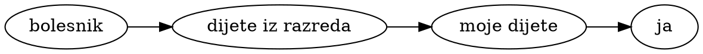
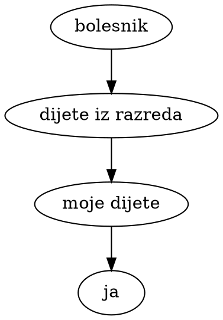
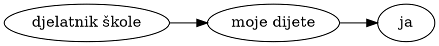
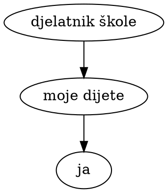

# Bi li trebao slati dijete u školu?


## Karta otvaranja škola

Hrvatska nije izuzetak u otvaranju škola. Većina zemalja Europske Unije je otvorila osnovne škole ili to planira skoro napraviti. Samo Italija, Rumunjska i Bugarska su najavili da ne namjeravaju otvarati osnovne škole prije ljeta. Švedska, Island i Bjelorusija nikad nisu prekidali fizičku nastavu u školama, iako je Bjelorusija bila produžila proljetne praznike na dva tjedna.

<figure id="ReopeningFig">
  <div id="ReopeningMap">Učitavam kartu...</div>
  <figcaption>
    Datumi otvaranja (ili djelomičnih otvaranja) nižih razreda osnovnih škola, stvarni ili planirani.
    Zemlje u kojima nije još donesen plan otvaranja su označene upitnikom.
    Zemlje u kojima nikad nije ni bilo zatvaranja osnovnih škola su označene kvačicom ✓.
    Izvori po zemljama: 
    <span id="SourcesForMap">učitavam...</span>
  </figcaption>
</figure>

U čemu je problem s postepenim otvaranjem škola i vrtića, i zašto se najmanja djeca često guraju prva nazad u kolektiv?

Prvo je pitanje koliko su sama djeca ugrožena kontaktom s drugim ljudima. Iako znamo jako malo o ovom virusu, postoji širok konsenzus kako inače zdrava djeca nisu ugrožena. Nije nemoguće da će se njima nešto loše dogoditi, ali je toliko malo vjerojatno da se ne isplati o tome brinuti.

Veći problem je širenje zaraze kroz populaciju preko djece u razredu. Na taj način zaraza može kolati i između kućanstava u istom mjestu ili kvartu. Tipično bi to išlo ovako:




To bi mogao biti "most" između dva kućanstva. Djeca bi mogla dolaziti zarazna u školu i više dana prije nego što itko shvati da bi dijete trebalo izolirati.

- vjerojatnost da će bar jedno dijete iz razreda doći u bliski kontakt s nekim bolesnikom
- vjerojatnost da se dijete zarazi od bolesnika 
- vjerojatnost da zaraženo dijete prenese bolest mom djetetu u razredu
- vjerojatnost da će moje dijete prenijeti bolest meni

Postoji i drugi put širenja zaraze koji kreće od učitelja ili drugog djelatnika škole:




Ovo je kraći, time vjerojatno i opasniji "most". 

Kako bi izračunali spojnu vjerojatnost ovog lanca događaja nameću mi se pitanja:

- Koliko zaraženih ljudi kola u populaciji, tj. nije u samoizolaciji?
- Kolika je vjerojatnost da se dijete zarazi od druge osobe, i u kojim okolnostima?
- Kolika je vjerojatnost da zarazno dijete dođe u školu? U slučaju da se otkrije kako je bilo u kontaktu sa zaraženom osobom, ili samo pokaže simptome zaraze, vjerojatno ne bi je poslali u školu.
- Kolika je vjerojatnost da zarazan djelatnik dođe raditi u školu?
- Kolika je vjerojatnost da učenik prenese zarazu drugom učeniku u razredu? Je li manja nego vjerojatnost prijenosa u kućanstvu, i koliko manja?
- Kolika je vjerojatnost da inficirano dijete zarazi odraslog ukućanina?

Ako ste pratili stanje našeg znanja o mehanici širenja novog virusa vjerojatno već imate osjećaj da su ovo pitanja na koja je vrlo teško odgovoriti s ikakvom sigurnosti. No svejedno, tu smo gdje smo, i moramo doći do nekog zaključka s onim što imamo jer se odluke moraju donijeti, a odbijanje donošenja odluka na temelju oskudnih i nepouzdanih informacija nosi rizike za sebe.

Nakon čitanja službenih preporuka i analiza (vidi dolje) nameću mi se i dvije hipoteze:

1. Djeca se teže zaraze od odraslih.
2. Djeca su manje zarazna od odraslih.

Ako se obje hipoteze pokažu točnima, onda se čini logično da bi i vjerojatnost da će se zaraza prenijeti s djeteta na dijete bila naročito malo vjerojatna. Ako je recimo dijete upola vjerojatno da se zarazi i upola vjerojatno da zarazi druge, i ako su vjerojatnosti neovisne, ukupna vjerojatnost jednog lanca odrasli → dijete → dijete → odrasli je tek jedna osmina kolika bi bila da su svi uključeni odrasle osobe.


## Koliko se djeca razboljevaju u Hrvatskoj?

Na koronavirus.hr imamo [podatke](https://www.koronavirus.hr/otvoreni-strojno-citljivi-podaci/526) o potvrđeno zaraženoj djeci u Hrvatskoj. Djeca godište 2009. do 2018. (vrtić i niži razredi O.Š.):

```vly.exceptMob
width: 600
height: 100
data:
  url: "/story/covid-kid-transfer/covid-cro-patients.json"
  format: {type: json}
transform:
  - filter: "datum.dob >= 2009 && datum.dob <= 2018"
mark:
  type: bar
encoding:
  x:
    title: datum
    field: Datum
    type: temporal
    axis:
      format: "%-d.%-m."
    scale:
      domain: ["2020-03-12", "2020-05-03"]
  y:
    title: novih slučajeva
    aggregate: count
    type: quantitative
    field: "*"
```

U posljednja dva tjedna brojim samo četiri slučaja u cijeloj Hrvatskoj. Koliko je od njih već bilo u samoizolaciji jer su imali od prije poznat kontakt? S druge strane, koliko djece nikad nismo testirali i nisu ušli u službenu statistiku? To bi bili ključne informacije da možemo procijeniti šansu da se netko od zaražene djece pojavi u razredu ili u vrtićkoj grupi.


## Što kažu javnozdravstvene institucije?

<!--
> Children are likely infected in their households [79]. Two studies on household transmission estimated the
household secondary attack rate (SAR) to be 16.3% [86] and 13.8% [87]. Age-stratified analysis showed that the
SAR in children was 4.7% compared with 17.1% in adults (≥ 20 years of age) [86], and that the odds of infection in children was 0.26 times (95%CI 0.13-0.54) of that among the elderly (≥ 60 years of age) [87]. 
Child-to-adult transmission appears to be uncommon. Data from population-based and cross-sectional studies indicate that children are unlikely to be primary source cases. 
-->

Prvo sam Europski centar za prevenciju i kontrolu bolesti (ECDC)

> još je neizvjesno u kojoj mjeri djeca igraju ulogu u prenošenju virusa drugima

<p class="right-align">ECDC, <a href="https://www.ecdc.europa.eu/en/covid-19/questions-answers">Pitanja i odgovori o COVID-19</a></p>

No, u svom devetom izdanju brze procjene rizika od COVID-a iznose kratku analizu istraživanja. Između ostalog, navode kako djeca u prosjeku zaraze tek 4,7% ukućana (dok odrasli zaraze 17,1%), i kako je dijete četiri puta manje vjerojatno da će se zaraziti od starijih osoba. Zaključuju:

> Čini se kako se rijetko događa da dijete zarazi odraslu osobu.
> Podaci (...) ukazuju kako nije vjerojatno da su djeca primarni izvor slučajeva zaraze.

<figcaption class="right-align">
  ECDC <a href="https://www.ecdc.europa.eu/sites/default/files/documents/covid-19-rapid-risk-assessment-coronavirus-disease-2019-ninth-update-23-april-2020.pdf">Rapid Risk Assessment - COVID-19 in the EU - ninth update</a>
</figcaption>

No koliko je uopće očekivati da će se djeca zaraziti ako ne idu u školu ni vrtić? Što se događalo u zemljama gdje su cijelo vrijeme epidemije pohađala školu?

### Švedska

Kao što sam napisao, Švedska je jedna od rijetkih zemalja na svijetu koja je držala otvorene osnovne škole. A definitivno imaju problema s pandemijom: po prijavljenim smrtnim slučajevima na milijun stanovnika odskaču od zemalja u okruženju, i od Hrvatske.

```vly.exceptMob
width: 600
height: 120
data:
  values:
    - country: Švedska
      deathsPerMil: 264
    - country: Danska
      deathsPerMil: 82
    - country: Norveška
      deathsPerMil: 39
    - country: Finska
      deathsPerMil: 40
    - country: Island
      deathsPerMil: 29
    - country: Hrvatska
      deathsPerMil: 19
mark:
  type: bar
encoding:
  y:
    title: null
    field: country
    type: nominal
    sort: -x
  x:
    title: smrti od COVID-19 na milijun stanovnika (1.5.2020.)
    field: deathsPerMil
    type: quantitative
```

No, iako imaju velikih problema s drugim kolektivima, poput staračkih domova, ne javljaju širenje u školama:

> Trenutno je znanje o tome koliko se COVID-19 širi među djecom vrlo ograničeno, i nema izvještaja o velikom prijenosu unutar grupa djece.

<!-- There is currently very limited knowledge about to what extent COVID-19 spreads between children, and there are no reports about extensive transmission within groups of children. -->

<figcaption class="right-align">
  Švedska agencija za javno zdravstvo: <a href="https://www.folkhalsomyndigheten.se/the-public-health-agency-of-sweden/communicable-disease-control/covid-19/covid-19-and-children/">
    COVID i djeca
  </a>
</figcaption>

### Island

Ni Island nije zatvarao škole. To je puno manja država ali je rekorder po testiranju populacije. Nisam našao stav njihove javnozdravstvene institucije, ali njihovi vodeći stručnjaci su bili uključeni u poznatu studiju širenja COVID-a koja je uključila 6% cijele populacije zemlje.

> Djeca mlađa od 10 godina imala su manju vjerojatnost da će dobiti pozitivan rezultat od osoba koje su bile starije, s postocima od 6,7% odnosno 13,7% za ciljano testiranje; u populacijskom probiru nijedno dijete mlađe od 10 godina nije imalo pozitivan rezultat, u usporedbi s 0,8% koji su imali 10 godina ili više.

<figcaption class="right-align">
  Gudbjartsson et al.
  <a href="https://www.nejm.org/doi/full/10.1056/NEJMoa2006100">
    Spread of SARS-CoV-2 in the Icelandic Population
  </a>,
  The New England Journal of Medicine, 2020-04-14
</figcaption>

Koautor rada u intervjuu iznosi dodatne tvrdnje:

> čak i kad se djeca zaraze, manje je vjerojatno da će prenijeti bolest drugima, nego što je to slučaj s odraslima. Nismo pronašli nijedan slučaj da je dijete zarazilo roditelje.

<figcaption class="right-align">
  <a href="https://www.sciencemuseumgroup.org.uk/hunting-down-covid-19/">
    Kari Stefansson
  </a>
</figcaption>


### Danska

Danska je prva u EU otvorila škole, već prije tri tjedna. Nema vijesti o 

<!-- The Danish Health Authority considers it prudent to open these institutions, in part because the spread of the epidemic in Denmark appears to be running a more protracted and less violent course, as described in the previous section. Furthermore, international feedback from other countries, including Iceland, indicates that there are not as many infected among these age groups, that children who become ill with COVID-19 often have very mild illnesses, and that they are probably not as contagious as other age groups. -->

> Iskustva drugi zemalja govore kako nema toliko zaraženih, kako oni koji obole često imaju vrlo blagi oblik bolesti, i kako su vjerojatno manje zarazni od drugih dobnih skupina.

<figcaption class="right-align">
  Danska zdravstvena uprava,
  <a href="https://www.sst.dk/da/corona-eng/faq">
    Pitanja i odgovori o koronavirusu
  </a>
</figcaption>

### Norveška

<!-- The number of children with confirmed cases has so far been low. This could indicate that children either get milder symptoms or are infected to a lesser degree.Since people with symptoms are the most contagious and children have little symptoms, they are probably less contagious than adults. When people with COVID-19 have been followed up in Norway, children appear to infect others to a small extent.

In previous outbreaks with other coronaviruses (MERS and SARS), infections were also rarely reported among children. -->

> Broj djece s potvrđenim slučajevima do sada je bio nizak. To bi moglo značiti da djeca ili dobivaju blaže simptome ili su zaražena u manjem stupnju. Budući da su ljudi koji imaju simptome najzarazniji, a djeca imaju malo simptoma, vjerojatno su manje zarazna od odraslih. Kada su osobe sa COVID-19 praćene u Norveškoj, čini se da djeca u maloj mjeri zaraze druge.

> U prethodnim epidemijama koronavirusa (MERS i SARS), rijetko kad su zabilježene infekcije među djecom.

<figcaption class="right-align">
  Norveški institut za javno zdravstvo (NIPH),
  <a href="https://www.fhi.no/en/op/novel-coronavirus-facts-advice/facts-and-general-advice/advice-and-information-for-children-and-adolescents/">
    Savjeti i informacije za djecu i adolescente
  </a>
</figcaption>

### Nizozemska

<!-- Children are less likely to be infected by adults. When this does happen, it turns out that it is mainly in the home situation. Patients under 20 years play a much smaller role in the spread than adults and the elderly.-->

> Djeca se rjeđe zaraze od odraslih. Kad se to dogodi, ispada da je to uglavnom kod kuće. Pacijenti mlađi od 20 godina igraju puno manju ulogu u širenju bolesti od odraslih i starijih osoba.

<figcaption class="right-align">
  <a href="https://www.rivm.nl/en/novel-coronavirus-covid-19/children-and-covid-19">
    Nizozemski Nacionalni institut za javno zdravstvo i okoliš
  </a>
</figcaption>

Navode i svoje istraživanje, po kojem maloljetnici nisu zarazili niti jedan kontakt od 43 ukupno, u kontrastu s punoljetnim pacijentima, koji su zarazili oko 10% svojih kontakata. To sugerira da su manje zarazni.


### Studija objavljena u Science-u

Prošli tjedan praćenja grozdova zaraze u Kini, konkretno u pokrajni Hunan, uspoređujući je s podacima iz Wuhana i Šangaja.

> sklonost zarazi s SARS-CoV2 se povećava s dobi. Mladi (0-14 godina) imaju niži rizik zaraze od osoba u dobi od 15 do 64 (omjer izgleda je 0,34)...

> U kineskoj pokrajni Hunan, od 136 analizirana slučaja koja su donijela bolest u kućanstvo samo jedan je bio mlađi od 15 godina. 

<!-- (Hunan) Index cases 0-14y = 1 case; 15-64y = 116 cases; 65+y = 19 cases

Exposure relative to the introduction of strict control measures (January 23, 2020) After = 5; Before = 58; Unclear = 73 -->

<figcaption class="right-align">
  Zhang et al,
  <a href="https://science.sciencemag.org/content/sci/early/2020/04/28/science.abb8001.full.pdf">
    Changes in contact patterns shape the dynamics of the COVID-19 outbreak in China
  </a>
  (<a href="https://science.sciencemag.org/content/sci/suppl/2020/04/28/science.abb8001.DC1/abb8001_Zhang_SM.pdf">
    Dodatak
  </a>),
  Science, 2020-04-29
</figcaption>

A to nije zbog toga što su škole bile zatvorene. Samo pet je prepoznato kao zaraze nakon strogih mjera zatvaranja, u usporedbi s 58 koji su se dogodile prije zatvaranja i 73 kod kojih je bilo nejasno kad su se točno dogodile. No možda ima veze s putovanjima u pokrajnu Hubei, jer mladi vjerojatno rjeđe putuju od ljudi u radnoj dobi.

### The Expert Groups of the Swiss National COVID-19 Science Task Force 

> The role of children and adolescents in the transmission of SarsCov2 remains highly uncertain

https://ncs-tf.ch/en/policy-briefs/the-role-of-children-in-transmission-20-april-20-en/


### NIH paper

> To date, no clustering or asymptomatic transmission among children has been documented.

<figcaption class="right-align">
  <a href="https://www.ncbi.nlm.nih.gov/pmc/articles/PMC7161491/">NIH</a>
</figcaption>

Hipoteziraju kako bi to moglo biti zbog praznika i zatvaranja škola u Kini na početku epidemije.


### Lancet paper

> djeca su pod sličnim rizikom infekcije kao i opća populacija, mada je manje vjerovatno da će imati ozbiljne simptome; stoga ih treba uzeti u obzir u analizama prijenosa i upravljanja

<p class="right-align">
  <a href="https://www.thelancet.com/pdfs/journals/laninf/PIIS1473-3099(20)30287-5.pdf">
    Epidemiology and transmission of COVID-19 in 391 cases and 1286 of their close contacts in Shenzhen, China: a retrospective cohort study
  </a>, The Lancet
</p>

### French Alps paper

> The fact that an infected child did not transmit the disease despite close interactions within schools suggests potential different transmission dynamics in children.

<figcaption class="right-align">
  <a href="https://academic.oup.com/cid/advance-article/doi/10.1093/cid/ciaa424/5819060">
    Cluster of coronavirus disease 2019 (Covid-19) in the French Alps, 2020
  </a>, Clinical Infectious Diseases
</figcaption>

### Don't forget the bubbles review

> Uloga djece u prijenosu je nejasna, ali dosljedni dokazi pokazuju manju vjerojatnost zaraze i nižu stopu dovođenja zaraze u kućanstva.

<figcaption class="right-align">
  Boast et al,
  <a href="https://dontforgetthebubbles.com/evidence-summary-paediatric-covid-19-literature/">
    An evidence summary of paediatric COVID-19 literature
  </a>
</figcaption>