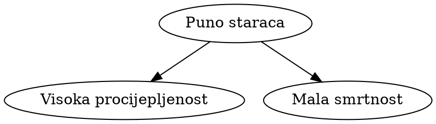

# COVID ranks

Prije mjesec-dva Europska komisija je objavila ovaj grafikon:

  

  

    

      <select name="leftKey" id="dd-left" onchange="updateInteractive()">
        <option value="fullVacPct">postotak stanovnika koji su potpuno cijepljeni</option>
        <option value="medAge">medijan dobi</option>
        <option value="hdi">HDI</option>
        <option value="lifeExp">očekivani životni vijek</option>
        <option value="gdppc">društveni bruto proizvod po stanovniku</option>
        <option value="age65p">postotak stanovnika starih 65 godina i više</option>
        <option value="doses">podijeljenih doza po stanovniku</option>
        <option value="deaths">preminulo od COVID-a na 100k stanovnika</option>
      </select>
    

    

      <select name="rightKey" id="dd-right" onchange="updateInteractive()">
        <option value="deaths">preminulo od COVID-a na 100k stanovnika</option>
      </select>
    

  

