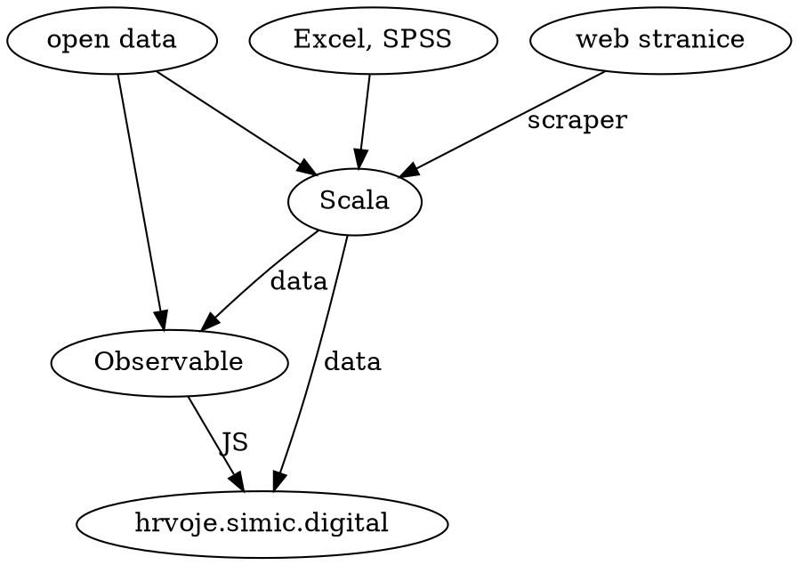

# Science knowledge and Covid

```vly
width: 350
height: 400
data:
  name: answers
transform:
  - filter: "datum.qcode == 'Q3'"
mark:
  type: bar
encoding:
  x:
    field: score
    type: quantitative
  y:
    title: novih slučajeva
    type: ordinal
    field: ccode    
    sort: x
```

<div id="Density" data-qcode="Q1" data-unit="postotni bod">
</div>

<div id="ph3">
</div>



<div id="Place">
</div>

<div id="ph2">
</div>
