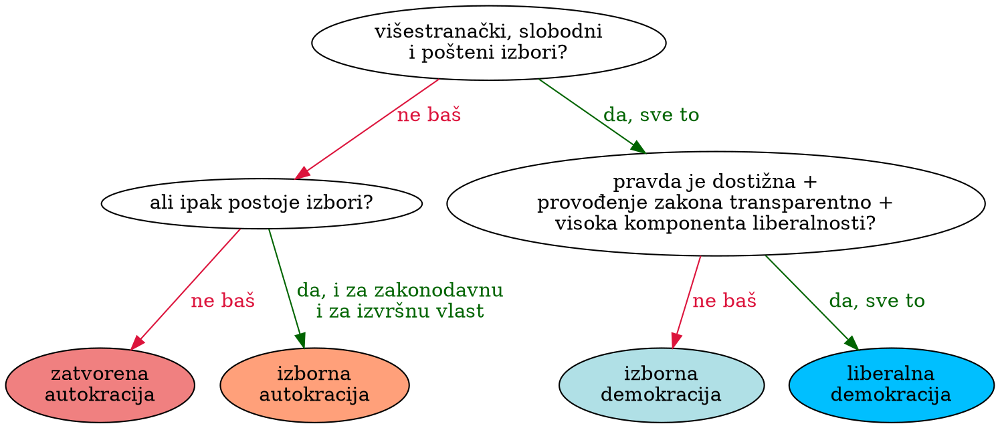

# Gdje su liberalne demokracije?

*Hrvoje Šimić, 14.04.2022.*

<span class="dropcap">R</span> anije sam [pisao](/a/ukraine-split) kako se na Ukrajinskim ravnicama ne bore samo jedan narod protiv drugog, nego i ideologije: imperijalizam, nacionalizam, realizam, liberalizam. Vidjeli smo kako liberalne demokracije svijeta vode ekonomsku i diplomatsku ofenzivu protiv Rusije. No koje zemlje zovemo liberalnim demokracijama, i zašto?

Na ovo pitanje je teško dati konačan odgovor, jer ljudi koriste nazive "liberalno" i "demokracija" za sve i svašta. Svejedno, pokušajmo. Ovdje ću se povesti primjerom [Our World in Data](https://ourworldindata.org/regimes-of-the-world-data), koji preuzimaju istraživanje projekta [_Varijacije demokracije_ (V-Dem)](https://v-dem.net/) znanstvenika Sveučilišta u Göteborgu u Švedskoj. Prema njima,

> **liberalne demokracije** su politički sustavi koji održavaju smislene, slobodne, poštene i višestranačke izbore, njihovi građani imaju dodatna osobna prava i jednaki su pred zakonom, a zakonodavstvo i sudovi ograničavaju izvršnu vlast.

Kao nastavak na V-Dem podatke, projekt [*Režimi svijeta*](https://www.cogitatiopress.com/politicsandgovernance/article/view/1214) se trudi iz opisa varijacija demokracije dobiti klasifikaciju režima. Koriste otprilike ovakav algoritam:


<figcaption>
  <strong>Slika 1.</strong> Pojednostavljena shema algoritma klasifikacije režima u četiri kategorije na dnu, prema parametrima iz V-Dem projekta. Prema Lührmann i dr., <a href="https://pdfs.semanticscholar.org/e09f/417c2d78b48fb100bea6dd728d95cb481c01.pdf"><i>Regimes of the World (RoW): Opening New Avenues for the Comparative Study of Political Regimes</i></a>, 2018.
</figcaption>

No što znači "visoka komponenta liberalnosti"? Da bi režim zadovoljio ovaj kriterij, mora većinom imati sljedeća svojstva (opet pojednostavljeno prenosim iz istog rada):

  - Jednakost pred zakonom
    - Nepristrana javna uprava
    - Zakoni su transparentni, a njihova provedba je predvidljiva
    - Građani imaju pristup pravosuđu
    - Poštuje se pravo vlasništva
  - Sloboda pojedinca
    - Sloboda od mučenja
    - Sloboda od političkih ubojstava
    - Sloboda od prisilnog rada
    - Sloboda vjeroispovijesti
    - Sloboda kretanja
  - Sudovi ograničavaju izvršnu vlast
    - Izvršna vlast poštuje ustav i pravosuđe
    - Neovisnost sudova
  - Zakonodavstvo ograničava izvršnu vlast
    - Zakonodavac u praksi ispituje dužnosnike i nadzire izvršnu vlast
    - Zakonodavno tijelo istražuje u praksi
    - Oporba prisutna u zakonodavstvu

## Karta svijeta

Sad možemo svaku zemlju svrstati u jednu od te četiri kategorije. Koje bi države danas spadale u kategoriju liberalne demokracije po njihovoj definiciji? Brzo se može primjetiti kako se najliberalnije demokracije pojavljuju u tri regije svijeta:

1. <b style="color:red">Jezgra Anglosfere</b>: Ujedinjeno Kraljevstvo, SAD, Kanada, Australija i Novi Zeland.
1. <b style="color:blue">Zapadna Europa</b> u širem smislu, tj. sve zemlje EU ili Šengenske zone koje nisu imale socijalističko uređenje.
1. <b style="color:green">Liberalne demokracije Dalekog istoka</b>: Japan, Južna Koreja, Tajvan i pridruženi član Hong Kong, autonomna pokrajna Kine koja ima svoj politički sustav.

Naravno, to ne znači da su sve liberalne demokracije sadržane u te tri regije, kao ni da je svaka zemlja u tim regijama liberalnija od svih zemalja izvan njih. Ako se ravnamo po trenutnoj ocjeni Režimi svijeta, u društvo liberalnih demokracija trenutno ne spadaju Portugal i Austrija, no neću ih sad zbog toga izbaciti.

Štoviše, dodat ću još jednu regiju u <b style="color:violet">svjetloljubičastom</b>: preostale članice EU, one koje su imale socijalističko uređenje nakon Drugog svjetskog rata. Taj "EU-Istok" je neka vrsta pripravnika među liberalnim demokracijama: samo Estonija i Latvija su trenutno u tom statusu, Mađarska je spala na izbornu autokraciju, dok sve druge slove kao izborne demokracije. Hrvatsku ću označiti <b style="color: #9400D3">tamnijom ljubičastom</b>.

Na kraju, da bi slika bila potpuna, bijelom bojom ćemo označiti i preostale liberalne demokracije koje se nalaze izvan naše četiri regije. To su: Barbados, Butan, Bocvana, Čile, Izrael, Kostarika, Sejšeli i Urugvaj. Sve relativno male države, razbacane po kontinentima bez neke geografske pravilnosti.

I tako smo dobili sljedeću kartu:

<figure>
  <p id="WorldMap">Loading map...</p>
  <figcaption>
    <strong>Slika 2.</strong> Regije s visokom koncentracijom liberalnih demokracija: <b style="color:red">crveno</b> Jezgra Anglosfere, <b style="color:blue">plavo</b> Zapadna Europa, <b style="color:green">zeleno</b> Liberalne demokracije Dalekog istoka. <b style="color:violet">Ljubičasto</b> su označene članice EU socijalističke prošlosti (neke od njih su liberalne demokracije). Bijelom bojom su označene liberalne demokracije svijeta izvan tih regija.
  </figcaption>
</figure>

Vidimo kako je liberalnih demokracija danas relativno malo, iako imaju veliki utjecaj na svjetsku politiku i gospodarstvo.

### Slobode

Prošli put sam koristio indeks _Freedom in the World_ kao mjeru razinu ljudskih sloboda i političkih prava po zemljama. Vjerojatno ne iznenađuje što naše obojene zemlje drže slobodniju stranu.

<figure>
  <div id="popFitw" class="BubbleDensity" data-rmax="70" data-keyX="fitw" data-keyr="population"></div>
  <figcaption>
    <strong>Slika 3.</strong> Slobode zemalja u svijetu prema indeksu _Freedom in the World_ organizacije [_Freedom House_](https://freedomhouse.org/) (više znači slobodnije). Površine krugova su razmjerne populaciji zemlje.
  </figcaption>
</figure>

### Indeks vladavine prava

Jedna od najvažnijih karakteristika liberalnih režima je vladavina prava i pridržavanje pravila. [_World Justice Project_](https://worldjusticeproject.org/rule-of-law-index/) za sebe kaže da je vodeći izvor neovisnih podataka o vladavini prava. Njihov indeks iz 2021. prikazuje veliki jaz između liberalnih demokracija i ostatka svijeta:

<figure>
  <div id="popHdi" class="BubbleDensity" data-rmax="70" data-keyX="wjp" data-decimals="2"></div>
  <figcaption>
    <strong>Slika 4.</strong> Zemlje svijeta po indeksu vladavine prava (od nula do jedan). Veći broj znači veću vladavinu prava. Površine krugova su razmjerne populaciji zemlje.
  </figcaption>
</figure>

### Sloboda medija

Sloboda govora je još jedan temelj liberalizma, a jedna ključna njena komponenta je sloboda medija. 
Nevladina organizacija [Reporteri bez granica](https://rsf.org/) redovito izdaje [_World Press Freedom Index_](https://rsf.org/en/ranking), po kojem su mediji slobodniji u državama s manjom vrijednosti indeksa. Kao što možemo vidjeti na razdiobi bodova iz 2022., podijela između sivih i obojanih postoji, ali nije ni blizu tako jasna. Čak i mnoge podsaharske zemlje šišaju EU članice Grčku, Bugarsku i Mađarsku.

<figure>
  <div class="BubbleDensity" data-rmax="70" data-keyX="press" forcex="1"></div>
  <figcaption>
    <strong>Slika 5.</strong> Zemlje s manjim indeksom imaju slobodnije medije. Površine krugova su razmjerne populaciji zemlje.
  </figcaption>
</figure>

### Zaštita ljudskih prava

Sljedeća kategorija koja je vezana uz liberalne demokracije su ljudska prava. 

**REMOVE**: nisam našao respektabilnu međunarodnu organizaciju koja rangira sve zemlje svijeta. Najbolje što imam je studija _Respect for Human Rights has Improved Over Time: Modeling the Changing Standard of Accountability_ iz 2014.

<figure>
  <div id="popGDPpc" class="BubbleDensity" data-rmax="70" data-keyX="fundRights"
    data-keyr="population" data-decimals="1"></div>
  <figcaption>
    <strong>Slika 6.</strong> Zemlje svijeta po indeksu zaštite ljudskih prava. Veći broj znači veću zaštitu ljudskih prava. Površine krugova su razmjerne populaciji zemlje.
  </figcaption>
</figure>


### Percepcija korupcije

<figure>
  <div id="popGDPpc" class="BubbleDensity" data-rmax="70" data-keyX="corruption" data-keyr="population"></div>
  <figcaption>
    <strong>Slika 7.</strong> Zemlje svijeta po [Indeksu percepcije korupcije](https://www.transparency.org/en/cpi/2021). Veći broj znači manju percepciju korupcije. Površine krugova su razmjerne populaciji zemlje.
  </figcaption>
</figure>

Opet imamo hrpu država koje imaju velike probleme s korupcijom, iz koje se izdvaja niz zemalja koje su mahom liberalne demokracije.

### BDP po glavi stanovnika

Bogatstvo zemlje se obično mjeri bruto društvenom proizvodu po glavi stanovnika. Na _logaritamskoj_ skali (!) zemlje svijeta su se 

<figure>
  <div id="popGDPpc" class="BubbleDensity" data-rmax="70" data-keyX="gdppc"
    data-keyr="population" data-scalex="log">
  </div>
  <figcaption>
    <strong>Slika 8.</strong> Zemlje svijeta po nominalnom bruto društvenom proizvodu. Površine krugova su razmjerne populaciji zemlje.
  </figcaption>
</figure>

### Indeks ljudskog razvoja

_Human Development Index_ (HDI) je pokazatelj razvoja država. Temelji se na svojstvima poput ishranjenosti, zdravlja, obrazovanja, sudjelovanja u zajednici i slično. Ne uzima u obzir osobno bogatstvo ni kvalitetu usluga i roba, pa se tu bogate zemlje ne ističu toliko u odnosu na srednje razvijene.

Podaci izvješća iz 2019. pokazuju liberalne demokracije kao odvojen grozd najrazvijenijih zemalja svijeta. 

<figure>
  <div id="popHdi" class="BubbleDensity" data-rmax="70" data-keyX="hdi" data-decimals="2"></div>
  <figcaption>
    <strong>Slika 9.</strong> Zemlje svijeta po indeksu ljudskog razvoja UN-ovog programa za razvoj (UNDP). Veći broj znači veću razinu ljudskog razvoja. Površine krugova su razmjerne populaciji zemlje.
  </figcaption>
</figure>

### Indeks sreće

Kad već gledamo, bacimo pogled i na jednu rang-listu koja se često pojavljuje u medijima: indeks sreće [_World Hapiness Report_-a](https://worldhappiness.report).

Osnovu ove mjere daje _Gallup World Poll_, na kojem se od ispitanika tražida zamisle ljestve koje se kreću od nula do deset, s najboljom mogućom verzijom svog života na vrhu, i najgorom mogućom na dnu. Zatim se od njih traže da procjene gdje se trenutno nalaze na tim ljestvama. Na temelju mnogih odgovora stanovnika svake zemlje dobijamo prosječan subjektivni indeks sreće za tu zemlju, između 0 i 10.

<figure>
  <div id="happy" class="BubbleDensity" data-rmax="70" data-keyX="happy"
       data-keyr="population" data-decimals="1"></div>
  <figcaption>
    <strong>Slika 10.</strong> Zemlje svijeta po indeksu sreće (veći broj znači veću sreću). Površine krugova su razmjerne populaciji zemlje.
  </figcaption>
</figure>

Na samom kraju opet se izdvajaju liberalne zemlje svijeta, naročito sjeverniji krajevi Europe, Anglosfera, dok je jug Europe tek iza dviju bogatih zemalja Arapskog poluotoka. Daleki Istok je tu izuzetak među liberalnim režimima, oni su bliže svjetskom prosjeku nego Skandinaviji.

### Očekivanje trajanja života

<figure>
  <div id="happy" class="BubbleDensity" data-rmax="70" data-keyX="lifeExp"
       data-keyr="population" data-decimals="1"></div>
  <figcaption>
    <strong>Slika 11.</strong> Zemlje svijeta po očekivanju trajanja života u trenutku rođenja. Površine krugova su razmjerne populaciji zemlje.
  </figcaption>
</figure>

### Smrtnost novorođenčadi

<figure>
  <div id="happy" class="BubbleDensity" data-rmax="70" data-keyX="infantMort"
       data-keyr="population" data-decimals="1" data-scalex="log"></div>
  <figcaption>
    <strong>Slika 12.</strong> Zemlje svijeta po smrtnosti novorođenčadi na 100 000 rođenja. Površine krugova su razmjerne populaciji zemlje.
  </figcaption>
</figure>

### Indeks ekonomske slobode

Kao zadnji graf ostavio sam jedan važan aspekt liberalizma, ekonomske slobode. 

<figure>
  <div id="popFitw" class="BubbleDensity" data-rmax="70" data-keyX="ioef"
    data-keyr="population">
  </div>
  <figcaption>
    <strong>Slika 11.</strong> Zemlje svijeta po indeksu ekonomske slobode. Veći broj znači veću ekonomsku slobodu. Površine krugova su razmjerne populaciji zemlje.
  </figcaption>
</figure>

Ovdje je puno veća gužva. Naše liberalne demokracije se drže slobodnije strane skupine, ali su tamo ispresjecane drugačijim režimima. Lijeva strana grafa je ostala pusta, na njoj tek par "klasičnih" socijalističkih režima svijeta: Sjeverne Koreje, Venezuele i Kube.

Iako se vidi kako su liberalne demokracije svijeta sve redom natprosječno ekonomski liberalne, očito je i da neliberalni režimi tu toliko ne zaostaju kao na drugim grafovima. Čak i najrepresivniji režimi su krajem 20. stoljeća uvidjeli kako je uska liberalizacija u tom području dobra za državni budžet. To se pogotovo važno u slučaju NR Kine, čija se Komunistička partija posljednjih desetljeća okrenula ideološki nekompatibilnim gospodarskim politikama poput privatnog poduzetništva.

### Liberalna demokracija stagnira

```vly
width: 450
height: 200
autosize: { resize: true }
data:
  name: popregdp
mark: area
encoding:
  x:
    timeUnit: year
    field: key
    title: godina
    axis:
      domain: false
      format: "%Y"
  y:
    aggregate: sum
    field: value
    axis: null
    stack: normalize
    sort: color
  color:
    field: prop
    title: vrsta režima
    legend:
      labelExpr: "datum.label == 'closedaut'? 'zatvorena autokracija' : datum.label == 'electaut'? 'izborna autokracija' : datum.label == 'electdem'? 'izborna demokracija' : datum.label == 'libdem'? 'liberalna demokracija' : '(nema podataka)'"
    sort: [missing, closedaut, electaut, electdem, libdem]
    scale:
      range: [white, crimson, darksalmon, LightSteelBlue, SteelBlue]
caption: Udio stanovništva svijeta u zemljama pod određenom vrstom režima prema klasifikaciji Režimi svijeta, kroz godine. 
```

Klasifikacija pokazuje određene trendove kroz 20. i početak 21. stoljeća. Zatvorene autokracije su prevladavale u prvoj polovici 20. stoljeća, kad ih naglo počinju zamjenjivati oblici vlasti temeljeni na izborima. Liberalne demokracije su imale nagli rast sve do 1970. i sad su u stagnaciji. Umjesto njih, na račun zatvorenih autokracija šire se izborna autokracija i izborna demokracija.

Korelacija 

<figure>
  <div class="Barchart" style="max-width: 500px" data-valuekey="population"></div>
  <figcaption>
    Režimi svijeta po vrsti. Visina pravokutnika je razmjena s brojem stanovnika.
  </figcaption>
</figure>

<figure>
  <div class="Barchart" style="max-width: 500px" data-valuekey="gdp"></div>
  <figcaption>
    Režimi svijeta po vrsti. Visina pravokutnika je razmjerna s BDP-om zemlje.
  </figcaption>
</figure>


<!--
### Power distance
<div id="Bubbles" class="BubbleXY" data-keyX="eiu" data-keyY="pdi"
  data-height="500" data-rmax="50" data-rdepth="1" data-keyr="gdp">
</div>

### Individuality vs Economist

<div id="xy-idv-eiu" class="BubbleXY" data-keyX="eiu" data-keyY="idv"
  data-height="500" data-rmax="50" data-rdepth="1" data-keyr="gdp">
</div>

### Freedom of the Press vs Economist

<div id="xy-press" class="BubbleXY" data-keyX="eiu" data-keyY="press"
  data-height="500" data-rmax="50" data-rdepth="1" data-keyr="gdp">
</div>


### Individuality

<div class="BubbleDensity" data-rmax="70" data-keyX="idv"
  data-keyr="population">
</div>


## Dictatorships vs democracies

<div id="regimeCamps" class="BubbleDensity" 
     data-forcex="0.2" data-forcey="0.2" data-minx="-1.5" data-maxx="1.5"
     data-rmax="100" data-keyx="regimeDim">
</div>
-->